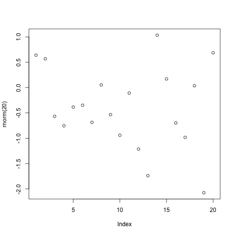

```{r setup, include=FALSE}
knitr::opts_chunk$set(echo = TRUE,warning=FALSE, message=FALSE)

library(tidyverse)
library(janitor)
library(easystats)
library(broom)

```

Here's my Exam 3 code. This was a bumpy ride. It all started when I had gotten all of my code for task I (except for exporting) together perfectly, then clean_names started bringing up an error that it doesn't accept data frames. So here is all of that reworked, the best I could.

```{r}
knitr::opts_chunk$set(echo = TRUE,warning=FALSE, message=FALSE)
sal<-read_csv("./Data/FacultySalaries_1995.csv")

#****clean it
sal1<-sal %>% 
  pivot_longer(names_to = "rank",values_to = "Salary",cols = ends_with("salary",)) %>%
  pivot_longer(names_to = "null",values_to = "Numbers_of",cols = starts_with("num")) %>% 
  select(-null) %>% 
  pivot_longer(names_to = "Null",values_to = "Comp",cols = ends_with("comp")) %>% 
  select(-Null) %>% 
  select(-AvgProfCompAll) %>% 
  select(-AvgProfSalaryAll)

#plot it
  WELCH_Plot_1<-sal1 %>% 
    ggplot(aes(x=rank,y=Salary,fill=rank))+
  facet_wrap(~Tier)+
  geom_boxplot()+
  theme_minimal() 
  
  #export it
  jpeg(".WELCH_Plot_1.jpeg", quality = 75)
```

```{r,fig.align='center',fig.width=5,fig.height=5}

```


Task II was kind of a continuation of the  wreck.

```{r}
knitr::opts_chunk$set(echo = TRUE,warning=FALSE, message=FALSE)

###****Task II###  
  mod1 <- glm(data=sal1,
              formula =Salary~State+Tier+rank) 
  Salary_ANOVA_Summary<-summary(mod1)

#****export ANOVA  
  write.table(Salary_ANOVA_Summary,".Salary_ANOVA_Summary.txt",
              row.names = F,sep = "\t")
```

Here's where the clouds parted and our story shifts.

```{r}
knitr::opts_chunk$set(echo = TRUE,warning=FALSE, message=FALSE)

###Task III###
#Read it
  dat<-read_csv("./Data/Juniper_Oils.csv")
  
#Clean it
  dat1<-dat %>% 
    select(-SampleID) %>% 
    select(-Project) %>% 
    select(-Amplicon) %>% 
    select(-Tree_Species) %>% 
    select(-BurnYear) %>% 
    select(-Latitude) %>% 
    select(-Longitude) %>% 
    select(-Field_Office) %>% 
    select(-BLM_Fire_Name) %>% 
    select(-Tracking_Number) %>% 
    select(-Yield_percent) %>% 
    select(-Bolt_Surface_Area_cm2) %>% 
    select(-Raw_Exit_Holes_per_cm2) %>% 
    select(-Raw_Exit_Holes) %>% 
    select(-Living_Larvae) %>% 
    select(-ChemTotal) %>% 
    select(-ChemMean) %>% 
    pivot_longer(names_to =("ChemicalID"),
                values_to =("Concentration"),
                cols = c("alpha-pinene","para-cymene","alpha-terpineol","cedr-9-ene",
                         "alpha-cedrene","beta-cedrene","cis-thujopsene",
                         "alpha-himachalene","beta-chamigrene","cuparene",
                         "compound 1","alpha-chamigrene","widdrol","cedrol",
                         "beta-acorenol","alpha-acorenol","gamma-eudesmol",
                         "beta-eudesmol","alpha-eudesmol","cedr-8-en-13-ol",
                         "cedr-8-en-15-ol","compound 2","thujopsenal"))
```

Smooth sailing into the plot.

```{r}
knitr::opts_chunk$set(echo = TRUE,warning=FALSE, message=FALSE)

###Task IV###
#Plot it
  dat1 %>% ggplot(aes(x=YearsSinceBurn,
             y=Concentration))+
    facet_wrap(~ChemicalID,scales = "free_y")+
    geom_smooth()
```

And the glm!

```{r}
knitr::opts_chunk$set(echo = TRUE,warning=FALSE, message=FALSE)

###Task V###
  mod1 <- glm(data=dat1,
              formula=Concentration~YearsSinceBurn*ChemicalID)
  
  tidy(mod1) %>% 
    filter(p.value<0.05)
```

